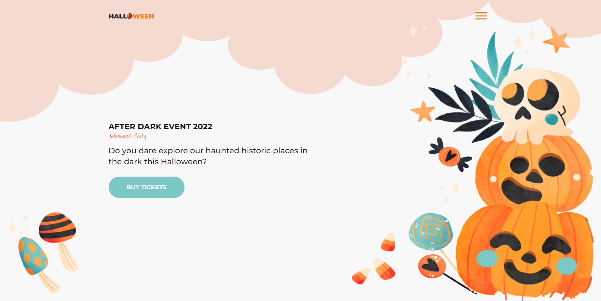

## Halloween Party Template

This is a Halloween-themed HTML template designed by codewithsadee. It features a spooky design perfect for Halloween events and parties.

### Features
- Dark and eerie design
- Responsive layout for mobile and desktop
- Preloader animation
- Navigation menu with smooth transitions
- Hero section with event details and call-to-action button

### Installation
Simply clone the repository and open the `index.html` file in your browser to view the template.

```bash
git clone https://github.com/your-username/halloween-party-template.git
cd halloween-party-template
```

### Usage
Feel free to customize the template to suit your needs. Update the content, colors, and images to match your event or party theme.

### Credits
- Fonts: Montserrat, Shadows Into Light
- Icons: Ionicons

### License
This template is licensed under the MIT License. See the [LICENSE](LICENSE) file for details.

### Preview


### Live Demo
[View Live Demo](https://halloween-landing-page-pied.vercel.app)
